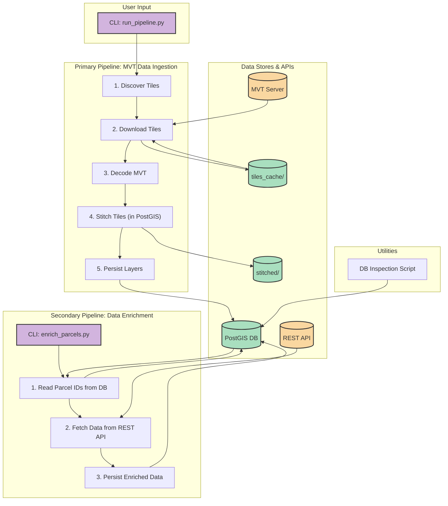

# Suhail Pipeline: Forensic Analysis Report

This document provides a detailed forensic analysis of the Suhail.AI data processing pipeline. The analysis was conducted by examining the source code, configuration files, and logs to reverse-engineer the system's architecture and data flow.

## System Architecture Diagram

The following diagram illustrates the complete, two-stage architecture of the pipeline, from initial data ingestion to final data enrichment.

## 1. Executive Summary

The system is composed of two distinct pipelines:

1.  **Primary Ingestion Pipeline**: A geospatial ETL pipeline that downloads Mapbox Vector Tiles (MVTs) based on a geographic area of interest, processes them, and stores the resulting vector layers (parcels, neighborhoods, streets, etc.) in a PostGIS database.
2.  **Secondary Enrichment Pipeline**: A post-processing pipeline that reads parcel data from the PostGIS database and enriches it with transactional, regulatory, and pricing data from a secondary, non-geospatial REST API.

The overall design is robust, scalable, and follows modern software engineering best practices. The separation of concerns between the two pipelines is a key architectural strength.

## 2. Primary Pipeline Analysis (`run_pipeline.py`)

This pipeline is responsible for constructing the foundational geospatial database from a tiled data source.

-   **Entry Point**: `run_pipeline.py`
-   **Orchestrator**: `src/suhail_pipeline/pipeline_orchestrator.py`
-   **Configuration**: `src/suhail_pipeline/config.py` (uses a `.env` file)
-   **Data Source**: `https://tiles.suhail.ai/maps/riyadh/{z}/{x}/{y}.vector.pbf`

### Stages:

1.  **Tile Discovery**: `get_tile_coordinates_for_bounds` calculates the necessary tile Z/X/Y coordinates to cover the requested bounding box.
2.  **Tile Download**: `AsyncTileDownloader` downloads tiles.
    -   **Key Features**: Asynchronous (`aiohttp`), concurrency-limited, persistent caching to `tiles_cache/`, rate-limiting, and automatic retries with exponential backoff. This component is highly resilient and performant.
3.  **MVT Decoding**: `MVTDecoder` uses `mapbox-vector-tile` and `pyproj` to parse the binary tile data and transform tile-local coordinates into standard EPSG:4326 (WGS 84) geometries.
4.  **Geometry Stitching**: `GeometryStitcher` merges the geometries from all tiles for a given layer.
    -   **Key Feature**: This component smartly offloads the computationally expensive `dissolve` operation to the PostGIS database using `ST_Union`. It writes all of a layer's features to a temporary table and executes a `GROUP BY` query, which is significantly more scalable than in-memory processing.
5.  **Persistence**: `PostGISPersister` writes the final, stitched GeoDataFrames to the database. It also saves a `.geojson` file for each layer in the `stitched/` directory for debugging.

## 3. Secondary Pipeline Analysis (`enrich_parcels.py`)

This pipeline adds business intelligence to the geospatial data.

-   **Entry Point**: `enrich_parcels.py`
-   **Data Source**: `https://api2.suhail.ai` (various endpoints)
-   **Database Tables Created**:
    -   `transactions`: Historical property sales data.
    -   `parcel_price_metrics`: Monthly time-series of average price per meter.
    -   `building_rules`: Zoning regulations and building constraints.

### Workflow:

1.  The script is invoked via a CLI command (e.g., `python enrich_parcels.py enrich`).
2.  It reads `parcel_objectid`s from the `parcels` table in the database.
3.  In batches, it asynchronously calls three different REST API endpoints to fetch transactions, building rules, and price metrics for the parcels.
4.  It uses an efficient "upsert" (`INSERT ... ON CONFLICT`) operation to write the enriched data back to the new tables in the database.

## 4. Other Components & Findings

-   **Database Inspector (`check_db.py`)**: A helpful command-line utility for inspecting the contents of the PostGIS database, including listing tables, counting features, and viewing distinct column values. It is a read-only tool.
-   **`pipeline.log`**: This log file is used by *both* pipelines. It contains a detailed history of operations, which is useful for debugging but can be confusing as the logs are interleaved.
-   **`temp_tiles/` Directory**: This directory is large but does not appear to be used by any of the current Python scripts. It is concluded to be a **legacy artifact** from a previous version of the pipeline or a one-off script. It is not part of the current workflow.

## 5. Conclusion & Recommendations

The Suhail.AI pipeline is a well-engineered, two-stage data processing system. Its strengths lie in its robust, asynchronous components, and particularly its intelligent use of PostGIS for scalable geometry processing.

-   **Recommendation 1**: Consider separating the log files for the two pipelines (e.g., `ingestion.log` and `enrichment.log`) to avoid confusion.
-   **Recommendation 2**: The `temp_tiles/` directory should be audited and, if confirmed to be unused, safely deleted to reclaim space and reduce project clutter.
-   **Recommendation 3**: The PostGIS-based stitching logic in `GeometryStitcher` is excellent but only implements the `'first'` aggregation rule. This could be extended to support `SUM`, `MEAN`, etc., as defined in the pipeline configuration, to make it even more flexible. 